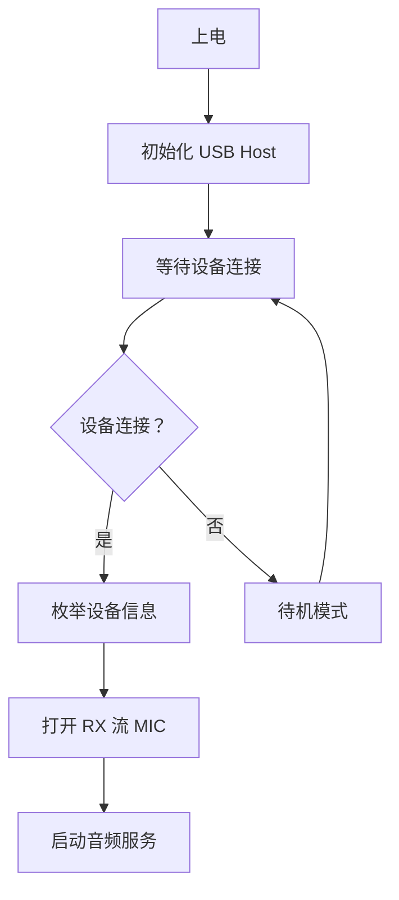

# USB Audio Codec (UAC) 实现文档

## 📋 概述

`UsbAudioCodec` 类实现了基于 USB Audio Class (UAC) 标准的音频编解码器，支持 ESP32-S3 作为 USB Host 连接 USB 麦克风设备。

**注意：当前实现仅支持麦克风输入，不支持 USB 扬声器输出。**

## 🎯 主要特性

- ✅ **支持 UAC1.0 和 UAC2.0** 设备
- ✅ **即插即用** - 自动检测和热插拔支持
- ✅ **单工模式** - 仅支持麦克风输入
- ✅ **自适应采样率** - 8k/11.025k/16k/22.05k/24k/32k/44.1k/48kHz 自动协商
- ✅ **零配置** - 自动枚举设备参数
- ✅ **低功耗** - 无音频活动时自动进入待机

## 🔧 技术规格

### 支持的参数

| 参数 | 范围 | 默认值 |
|------|------|--------|
| 采样率 | 8k, 11.025k, 16k, 22.05k, 24k, 32k, 44.1k, 48k Hz | 16k Hz |
| 位宽 | 16 位 (UAC1.0), 16/24/32 位 (UAC2.0) | 16 位 |
| 通道数 | 1 (单声道), 2 (立体声) | 自动检测 |
| 缓冲区 | 6 DMA 描述符 × 240 样本 | 固定 |

### 资源占用

| 资源 | 占用量 | 备注 |
|------|--------|------|
| RAM | ~15KB | USB 协议栈 + 缓冲区（仅麦克风）|
| CPU | 3-8% | 取决于采样率和通道数 |
| USB Host | 1 个 | 独占 USB OTG 接口 |

## 💻 使用方法

### 1. 基本实例化

```cpp
#include "usb_audio_codec.h"

// 创建 16kHz USB 麦克风编解码器（output_sample_rate = 0 禁用输出）
auto codec = new UsbAudioCodec(16000, 0);

// 在 Board 中返回
AudioCodec* Board::GetAudioCodec() {
    static UsbAudioCodec* codec = nullptr;
    if (codec == nullptr) {
        codec = new UsbAudioCodec(16000, 0);
    }
    return codec;
}
```

### 2. 配置 menuconfig

确保在 `idf.py menuconfig` 中启用以下选项：

```
Component config → USB Support → Enable USB Host Driver [✓]
Component config → USB Support → USB Host UAC Driver [✓]
```

### 3. 添加依赖

在 `main/idf_component.yml` 中添加：

```yaml
dependencies:
  espressif/usb_host_uac: latest
  idf: ">=5.4.0"
```

### 4. 完整示例

```cpp
// main/application.cc
#include "usb_audio_codec.h"
#include "audio_service.h"

void app_main(void) {
    // 创建 USB 麦克风编解码器（禁用输出）
    auto codec = new UsbAudioCodec(16000, 0);
    
    // 创建并初始化音频服务
    auto audio_service = new AudioService();
    audio_service->Initialize(codec);
    
    // 启动音频服务
    audio_service->Start();
    
    // 主循环
    while (true) {
        vTaskDelay(pdMS_TO_TICKS(1000));
        
        // 检查设备状态
        // USB 设备会自动重连，无需手动干预
    }
}
```

## 🔄 工作流程

### 启动流程



### 数据流向

```
USB 麦克风 → usb_host_uac_stream_read() → Read() → AudioService
```

## 🛠️ API 参考

### 构造函数

```cpp
UsbAudioCodec(int input_sample_rate, int output_sample_rate);
```

**参数**:
- `input_sample_rate`: 期望的麦克风采样率（Hz）
- `output_sample_rate`: 期望的输出采样率（Hz），设为 0 禁用输出

**示例**:
```cpp
auto codec = new UsbAudioCodec(16000, 0);  // 16kHz 麦克风，禁用输出
```

### Start()

初始化 USB Host 并等待设备连接。

```cpp
void Start() override;
```

**注意**: 此方法会阻塞最多 5 秒等待设备连接

### EnableInput()

启用或禁用麦克风输入。

```cpp
void EnableInput(bool enable) override;
```

**参数**:
- `enable`: true 启用，false 禁用

### EnableOutput()

启用或禁用输出（当前实现中始终禁用）。

```cpp
void EnableOutput(bool enable) override;
```

**参数**:
- `enable`: true 启用，false 禁用（但实际无效）

### SetOutputVolume()

设置输出音量（当前实现中无效）。

```cpp
void SetOutputVolume(int volume) override;
```

**参数**:
- `volume`: 0-100（百分比，但实际无效）

## ⚠️ 注意事项

### 硬件要求

1. **仅支持 ESP32-S3**
   - ESP32、ESP32-C3 等不支持 USB Host
   
2. **USB 供电**
   - 确保开发板能提供足够的 USB 电流（通常 100mA+）
   - 某些 USB 麦克风可能需要外部供电

3. **GPIO 冲突**
   - USB 使用 GPIO19 (D+) 和 GPIO20 (D-)
   - 这些 GPIO 不能用于其他用途

### 兼容性

#### 已知兼容的设备
- ✅ Logitech H390 USB 耳机（仅麦克风部分）
- ✅ Generic USB Microphone (C-Media)
- ✅ USB 麦克风（Generic UAC1.0）

#### 可能不兼容的设备
- ❌ 需要特殊驱动的 USB 设备
- ❌ USB 3.0 高速设备（ESP32-S3 仅支持 USB 2.0 Full Speed）
- ❌ 复合设备（同时包含音频和其他功能）

### 性能限制

1. **延迟**: USB 枚举增加约 1-2 秒启动延迟
2. **带宽**: USB Full Speed 最大 12Mbps，足够音频传输
3. **CPU 占用**: 额外 3-8% CPU 用于 USB 协议处理

## 🐛 故障排查

### 问题 1: 无法识别设备

**症状**: 日志显示 "No USB audio device found"

**解决方法**:
```bash
# 1. 检查 USB 连接
# 2. 确认设备是 UAC 标准设备
# 3. 尝试不同 USB 设备
# 4. 检查供电是否充足
```

### 问题 2: 音频断断续续

**症状**: 录音有爆音、中断

**可能原因**:
- CPU 负载过高
- 缓冲区大小不足
- USB 总线干扰

**解决方法**:
```cpp
// 增加缓冲区大小（在头文件中修改）
#define AUDIO_CODEC_DMA_DESC_NUM 8   // 从 6 增加到 8
#define AUDIO_CODEC_DMA_FRAME_NUM 480 // 从 240 增加到 480
```

### 问题 3: 设备频繁断开

**症状**: 日志反复显示 connected/disconnected

**可能原因**:
- USB 线缆质量差
- 电源不稳定
- EMI 干扰

**解决方法**:
1. 使用屏蔽良好的 USB 线
2. 添加去耦电容
3. 远离高频信号源

## 📊 日志示例

### 正常启动日志

```
I (1234) UsbAudioCodec: UsbAudioCodec created - Input: 16000Hz, Output: disabled
I (2345) UsbAudioCodec: Starting USB Audio codec...
I (2456) UsbAudioCodec: Initializing USB Host...
I (2567) UsbAudioCodec: USB Host initialized
I (3678) UsbAudioCodec: Waiting for USB audio device...
I (4789) UsbAudioCodec: USB Audio device connected
I (4890) UsbAudioCodec: Device Info:
I (4891) UsbAudioCodec:   Manufacturer: C-Media Electronics Inc.
I (4892) UsbAudioCodec:   Product: USB Audio Device
I (4893) UsbAudioCodec:   VID: 0x0D8C, PID: 0x0014
I (4894) UsbAudioCodec:   Stream Type: RX(MIC)
I (5001) UsbAudioCodec: RX stream opened successfully - Channels: 1, Sample Rate: 16000Hz
I (5223) UsbAudioCodec: USB Audio codec started successfully (microphone only)
```

### 设备断开日志

```
W (123456) UsbAudioCodec: USB Audio device disconnected
W (123457) UsbAudioCodec: RX (MIC) stream stopped
```

### 设备重连日志

```
I (234567) UsbAudioCodec: USB Audio device connected
I (234678) UsbAudioCodec: RX stream opened successfully
```

## 🔬 高级配置

### 自定义采样率

```cpp
// 使用 48kHz 高采样率
auto codec = new UsbAudioCodec(48000, 0);

// 注意：需要在 AudioService 中配置重采样到 16kHz
// 因为 Opus 编码器固定使用 16kHz
```

### 仅使用麦克风（单工）

```cpp
auto codec = new UsbAudioCodec(16000, 0);  // output_sample_rate = 0 禁用输出
```

## 📚 参考资料

- [ESP-IDF USB Host UAC 文档](https://docs.espressif.com/projects/esp-idf/en/latest/esp32s3/api-reference/peripherals/usb_host_uac.html)
- [USB Audio Class 规范](https://www.usb.org/audio)
- [ESP-IoT-Solution USB 示例](https://github.com/espressif/esp-iot-solution/tree/master/examples/usb/usb_camera_lcd_display)

## 🤝 贡献

欢迎提交 Issue 和 Pull Request 来改进这个实现！

---

**最后更新**: 2026-03-27  
**作者**: Jabob Team  
**许可证**: Apache-2.0
